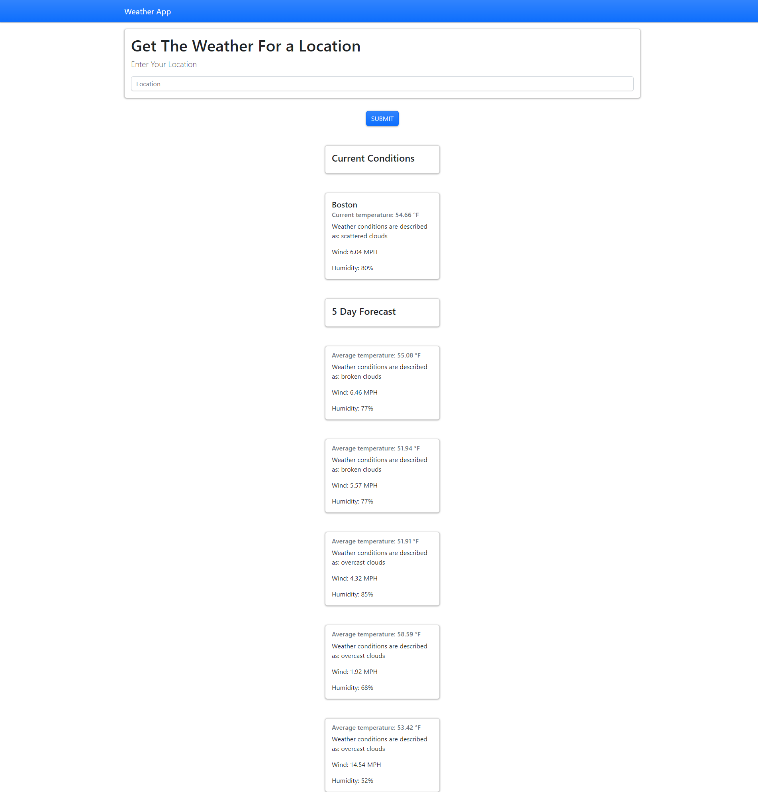

##Weather Application

## Description

This application retrieves weather data on a given city when the city is searched

This application allows the user to easily find the temperature, weather conditions, humidity and wind speed of any city they want, including the following 5 days forecast

## Table of Contents

1. [Installation](#installation)
2. [Usage](#usage)
3. [Credits](#usage)
4. [Licensing](#licensing)
5. [Tests](#test)
6. [Questions](#questions)

## Installation

The GitHub Repository can be found here: https://github.com/mbottoms3/weather_application

## Usage

Open index.html in your browser

## Credits

There were no collaborators on this project

## Licensing

This project uses the MIT license.

## Tests

NA

## Questions

If there are any questions please reach out to me at bottoms.micah.3@gmail.com

Github profile: [mbottoms3](https://github.com/mbottoms3)

